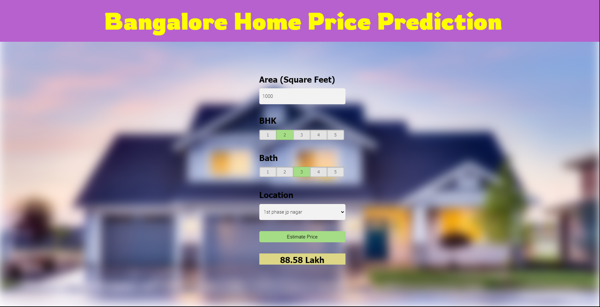
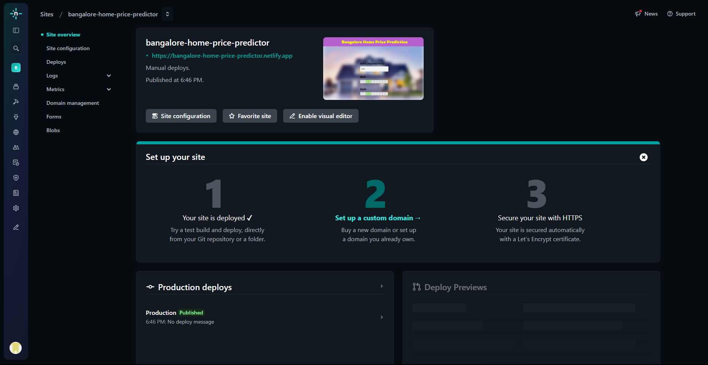
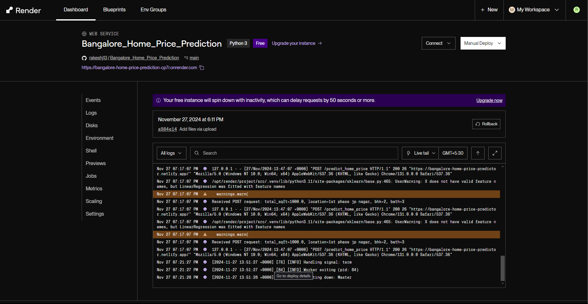

# Bangalore Home Price Prediction Project

## Overview
This project predicts home prices in Bangalore based on features like location, area, number of bedrooms, and bathrooms. The application includes a Flask backend to serve predictions and a static frontend for user interaction.

The project consists of:
- **Backend**: Flask application deployed on Render for serving predictions.
- **Frontend**: Static website built using HTML, CSS, and JavaScript, hosted on [Netlify](https://bangalore-home-price-predictor.netlify.app/).

---

## Features
1. **Machine Learning Model**:
   - Linear Regression (Best performing model with R² score of **0.818**).
2. **REST API**:
   - Exposes a `/predict_home_price` endpoint for predictions.
3. **Frontend**:
   - User-friendly form for inputting property details.
   - Displays predicted prices fetched from the backend.
   - Includes images and styling for better UI/UX.

---

## Images:

- **User Interface**:
  

- **Netlify Deployment**:
  

- **Render Deployment**:
  
  
---

## Deployment Architecture
- **Backend**:
  - Hosted on Render with Flask.
  - Model serialized using `pickle`.
- **Frontend**:
  - Hosted on Netlify: [Bangalore Home Price Predictor](https://bangalore-home-price-predictor.netlify.app/).
  - Communicates with the backend API using JavaScript.

---

## ML Performance Metrics
The machine learning models used in this project were evaluated on multiple performance metrics to ensure the best possible results. Below are the metrics for the top models:

| Model               | R² Score |
|---------------------|----------|
| **Linear Regression** | 0.818    |  
| **Lasso Regression**  | 0.806    | 
| **Decision Tree**     | 0.760    | 

These performance metrics highlight that **Linear Regression** performed the best, achieving the highest R² score, which indicates the model’s ability to explain the variance in the home price data.

---
